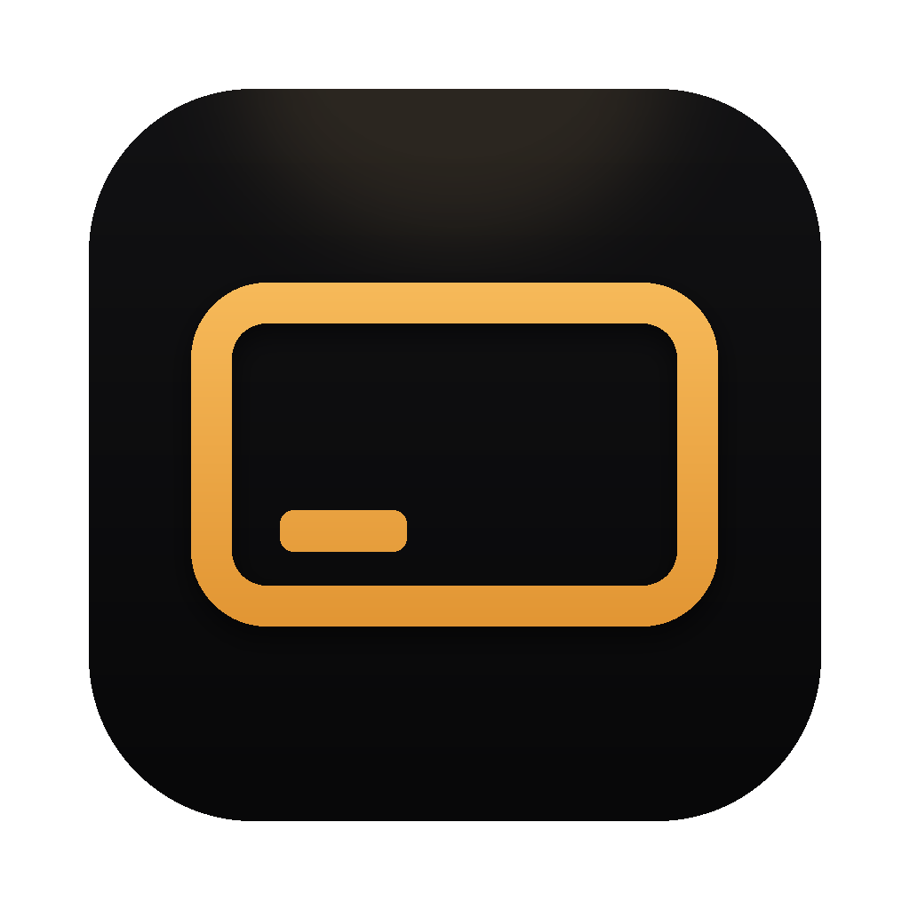
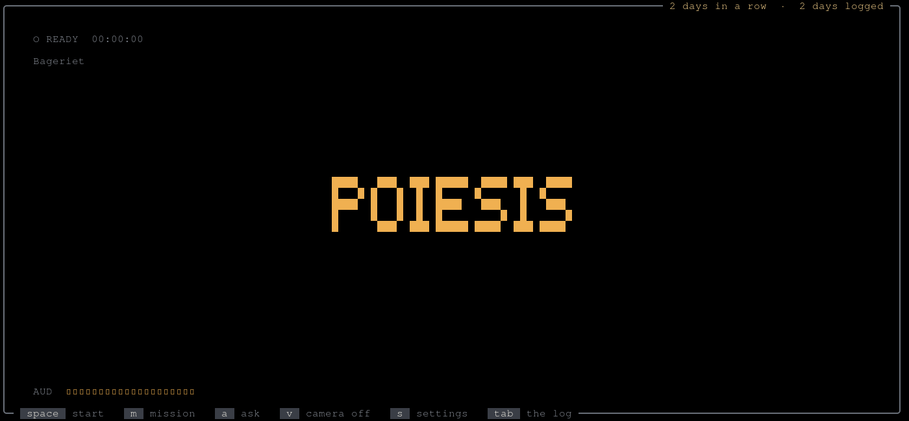
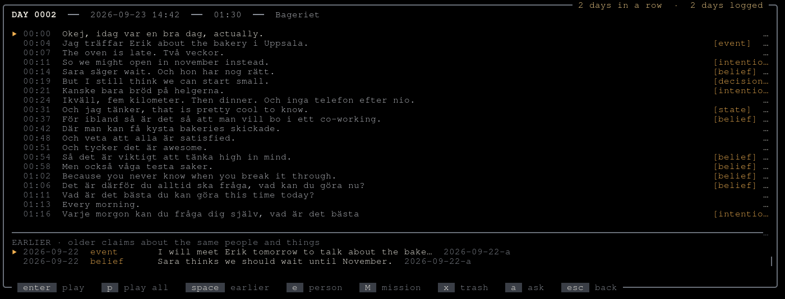
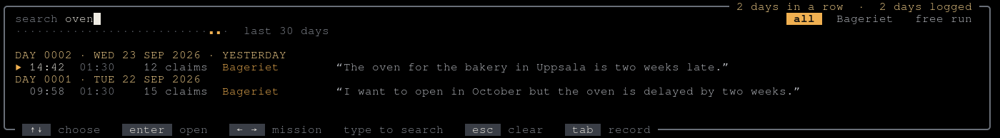

<p align="center">
  
</p>

<h1 align="center">Poiesis</h1>

<p align="center">
  <b>Say it once. It comes back.</b><br>
  A video journal any AI can read. Free, open source, on your own Mac.
</p>

<p align="center">
  <a href="#install">Install</a> ·
  <a href="#how-it-works">How it works</a> ·
  <a href="#the-promise">The promise</a>
</p>

<p align="center">
  
</p>

Talk to the camera for three minutes. Poiesis keeps your exact words and the second you said
them, ties them to the people, places and missions you mention, and gives them back when they
matter. In files you keep, on your own machine.

## Not notes. A living log.

Notes wait for you to remember them. A living log remembers for you: what you say once comes
back when the same people, places and plans come up again.

> **"The whole family loved the stew."**<br>
> Three years later you have no idea what to cook. You ask, and the stew comes back, with the
> second you said it.

> **"Legs heavy. Slept five hours."**<br>
> Six weeks into a marathon plan, every morning you said something like it lies side by
> side, each with its clip.

> **"I'll show the first version to someone this week."**<br>
> On Monday you ask what you said you would do. The three things come back, each with the
> moment you said it.

## How it works

1. **Talk.** Press space, say what is on your mind, press enter. Three minutes at most, and
   you can pause when life interrupts.
2. **It listens.** Speech to text runs on your Mac, in Swedish and English, even both in one
   entry.
3. **It sorts what you said.** What happened, what you decided, what you mean to do, what you
   felt. Each piece keeps your exact words and its second in the clip, and lands with the
   person, place or mission it belongs to. Nothing to tag.
4. **It comes back.** Open an entry, and what you said earlier about the same people and
   plans is right below it.

<p align="center">
  
</p>

Search every day at once:

<p align="center">
  
</p>

Then ask the AI you already use, Claude, Cursor or any app that speaks MCP: *what did I say
about the bakery in August?* It answers from your log, with the moment you said it.

Or tell it you want to talk: *I need to think out loud about the launch.* Poiesis opens,
ready, with *the launch* as the line to talk about. You press space.

<sub>The pictures show a fictional demo log.</sub>

## Your files

Your log is a folder of plain files. Open it with anything: Obsidian opens it, so does grep.

```
Poiesis Vault/
  episodes/2026-09-23-a.md             the entry: your words, with their times
  episodes/2026-09-23-a.claims.jsonl   what you did, decided and felt, each with its second
  entities/erik.md                     everything you said about Erik, over time
  raw/2026/09/…mp4                     the recording, the truth every page is rebuilt from
```

The format is open ([docs/FORMAT.md](docs/FORMAT.md), MIT licensed), so any tool can read and
write a Poiesis log, your own AI connection included.

## The promise

You only talk freely where you know no one else is listening. So:

- **It runs on your computer:** the recording, the words, the sorting.
- **Video and sound never leave it.**
- **Any AI you connect can read your log. None can change it.**
- **An AI can open Poiesis ready when you ask. Only you press record.**
- **Your folder follows your own backup and sync,** for example iCloud.
- **Free and open source. Your words are never sold.**

Exactly what reaches the network, and when: [docs/INSTALL.md](docs/INSTALL.md#what-reaches-the-network).

## Install

On a Mac with Apple silicon and macOS 14 or later, paste one line into Terminal:

```sh
curl -fsSL https://raw.githubusercontent.com/alexandrwilder/poiesis/main/install.sh | sh
```

Then press space, talk, press enter. Tonight is entry one.

Other ways to install, what it needs, updates and how to remove it:
[docs/INSTALL.md](docs/INSTALL.md). Linux and Windows are next.

## Made in the open

Poiesis is free and open source ([AGPL-3.0](LICENSE)), and the log's format is
[MIT](LICENSES/MIT.txt). It is built with Go, whisper.cpp, Ollama and a small native window
for each system: [how it is built](docs/ARCHITECTURE.md).

Want to help? Start with a
[good first issue](https://github.com/alexandrwilder/poiesis/labels/good%20first%20issue) and
read [CONTRIBUTING](CONTRIBUTING.md). Every tool inside the app is credited in [NOTICE](NOTICE.md).
The name and the mark: [TRADEMARK](TRADEMARK.md).
Found a security problem: [SECURITY](SECURITY.md).

Made by Alexander Adolfsson in Stockholm. *Poiesis* is said poy-EE-sis, the Greek word for
making.
